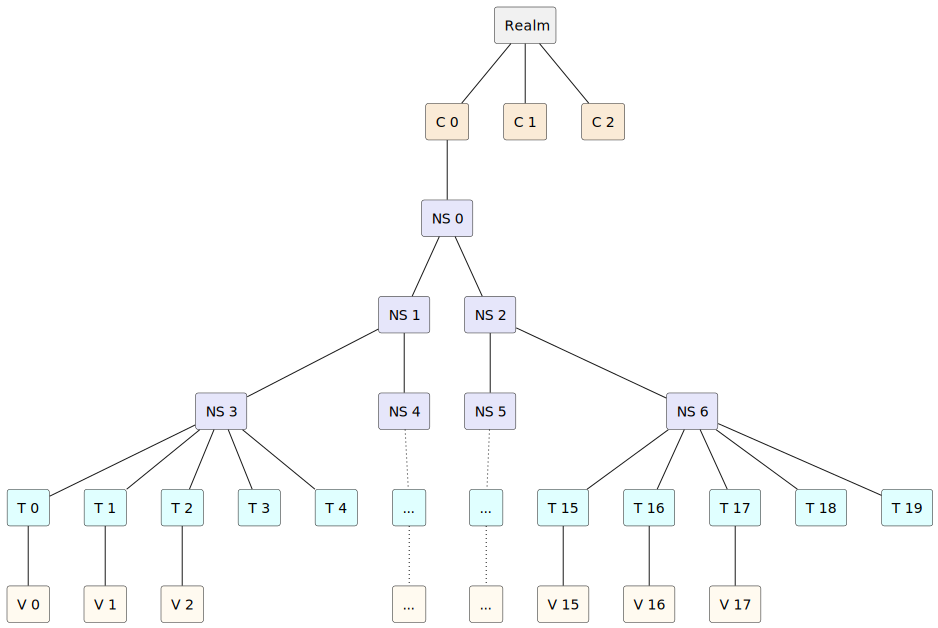
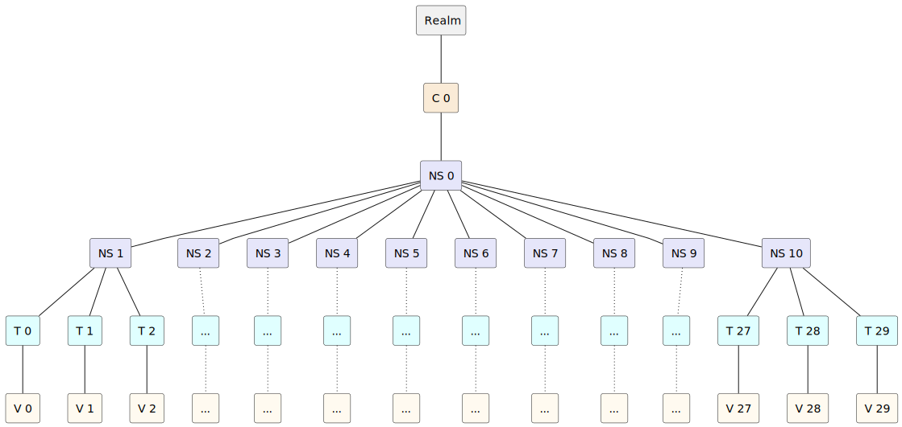
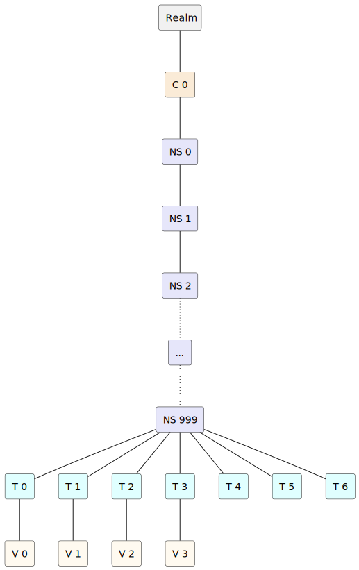
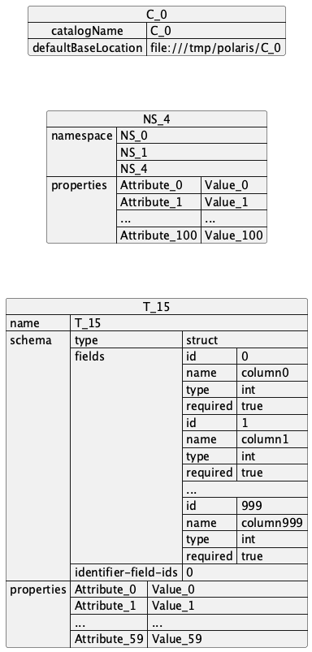

<!--
  Licensed to the Apache Software Foundation (ASF) under one
  or more contributor license agreements.  See the NOTICE file
  distributed with this work for additional information
  regarding copyright ownership.  The ASF licenses this file
  to you under the Apache License, Version 2.0 (the
  "License"); you may not use this file except in compliance
  with the License.  You may obtain a copy of the License at
 
   http://www.apache.org/licenses/LICENSE-2.0
 
  Unless required by applicable law or agreed to in writing,
  software distributed under the License is distributed on an
  "AS IS" BASIS, WITHOUT WARRANTIES OR CONDITIONS OF ANY
  KIND, either express or implied.  See the License for the
  specific language governing permissions and limitations
  under the License.
-->

# Polaris Benchmarks

This repository contains benchmarks for the Polaris service using Gatling.

## Available Benchmarks

### Dataset Creation Benchmark

The CreateTreeDataset benchmark creates a test dataset with a specific structure. It exists in two variants:

- `org.apache.polaris.benchmarks.simulations.CreateTreeDatasetSequential`: Creates entities one at a time
- `org.apache.polaris.benchmarks.simulations.CreateTreeDatasetConcurrent`: Creates up to 50 entities simultaneously

These are write-only workloads designed to populate the system for subsequent benchmarks.

### Read/Update Benchmark

The ReadUpdateTreeDataset benchmark tests read and update operations on an existing dataset. It exists in two variants:

- `org.apache.polaris.benchmarks.simulations.ReadUpdateTreeDatasetSequential`: Performs read/update operations one at a time
- `org.apache.polaris.benchmarks.simulations.ReadUpdateTreeDatasetConcurrent`: Performs up to 20 read/update operations simultaneously

These benchmarks can only be run after using CreateTreeDataset to populate the system.

## Parameters

### Dataset Structure Parameters

These parameters must be consistent across all benchmarks:

- `NUM_CATALOGS`: Number of catalogs to create (default: 1)
- `NAMESPACE_WIDTH`: Width of the namespace tree (default: 2)
- `NAMESPACE_DEPTH`: Depth of the namespace tree (default: 4)
- `NUM_TABLES_PER_NAMESPACE`: Tables per namespace (default: 5)
- `NUM_VIEWS_PER_NAMESPACE`: Views per namespace (default: 3)
- `NUM_COLUMNS`: Columns per table (default: 10)
- `DEFAULT_BASE_LOCATION`: Base location for datasets (default: file:///tmp/polaris)

### Workload Parameters

These parameters can vary between benchmarks:

- `CLIENT_ID`: Required OAuth2 client ID
- `CLIENT_SECRET`: Required OAuth2 client secret
- `BASE_URL`: Service URL (default: http://localhost:8181)
- `READ_WRITE_RATIO`: Ratio of read to write operations (for ReadUpdateTreeDataset only)

## Running the Benchmarks

Required environment variables:
```bash
export CLIENT_ID=your_client_id
export CLIENT_SECRET=your_client_secret
export BASE_URL=http://your-polaris-instance:8181
```

To run the sequential dataset creation benchmark:
```bash
./gradlew gatlingRun-org.apache.polaris.benchmarks.simulations.CreateTreeDatasetSequential
```

To run the concurrent dataset creation benchmark:
```bash
./gradlew gatlingRun-org.apache.polaris.benchmarks.simulations.CreateTreeDatasetConcurrent
```

To run the sequential read/update benchmark:
```bash
export READ_WRITE_RATIO=0.8  # 80% reads, 20% writes
./gradlew gatlingRun-org.apache.polaris.benchmarks.simulations.ReadUpdateTreeDatasetSequential
```

To run the concurrent read/update benchmark:
```bash
export READ_WRITE_RATIO=0.8  # 80% reads, 20% writes
./gradlew gatlingRun-org.apache.polaris.benchmarks.simulations.ReadUpdateTreeDatasetConcurrent
```

A message will show the location of the Gatling report:
```
Reports generated in: ./benchmarks/build/reports/gatling/<simulation-name>/index.html
```

### Example Polaris server startup

For repeated testing and benchmarking purposes it's convenient to have fixed client-ID + client-secret combinations. **The following example is ONLY for testing and benchmarking against an airgapped Polaris instance**

```bash
# Start Polaris with the fixed client-ID/secret admin/admin
# DO NEVER EVER USE THE FOLLOWING FOR ANY NON-AIRGAPPED POLARIS INSTANCE !!
./gradlew :polaris-quarkus-server:quarkusBuild &&  java \
  -Dpolaris.bootstrap.credentials=POLARIS,admin,admin \
  -Djava.security.manager=allow \
  -jar quarkus/server/build/quarkus-app/quarkus-run.jar

With the above you can run the benchmarks with the environment variables `CLIENT_ID=admin` and `CLIENT_SECRET=admin` - meant only for convenience in a fully airgapped system.
# Test Dataset

The benchmarks use synthetic procedural datasets that are generated deterministically at runtime. This means that given the same input parameters, the exact same dataset structure will always be generated. This approach allows generating large volumes of test data without having to store it, while ensuring reproducible benchmark results across different runs.

The diagrams below describe the data sets that are used in benchmarks. Note that the benchmark dataset may not cover all Polaris features.

## Generation rules

The dataset has a tree shape. At the root of the tree is a Polaris realm that must exist before the dataset is created.

An arbitrary number of catalogs can be created under the realm. However, only the first catalog (`C_0`) is used for the rest of the dataset.

The namespaces part of the dataset is a complete `N`-ary tree. That is, it starts with a root namespace (`NS_0`) and then, each namespace contains exactly `0` or `N` children namespaces. The width as well as the depth of the namespaces tree are configurable. The total number of namespaces can easily be calculated with the following formulae, where `N` is the tree arity and `D` is the total tree depth, including the root:

$$\text{Total number of namespaces} =
\begin{cases}
    \frac{N^{D} - 1}{N - 1} & \mbox{if } N \gt 1 \\
    D & \mbox{if } N = 1
\end{cases}$$

The tables are created under the leaves of the tree. That is, they are put under the namespaces with no child namespace. The number of tables that is created under each leaf namespace is configurable. The total number of tables can easily be calculated with the following formulae, where `N` is the tree arity, `D` is the total tree depth, and `T` is the number of tables per leaf namespace:

Total number of tables = *N*<sup>*D* − 1</sup> \* *T*

The views are created alongside the tables. The number of views that is created under each leaf namespace is also configurable. The total number of views can easily be calculated with the following formulae, where `N` is the tree arity, `D` is the total tree depth, `V` is the number of views per leaf namespace:

Total number of tables = *N*<sup>*D* − 1</sup> \* *V*

## Binary tree example

The diagram below shows an example of a test dataset with the following properties:

-   Number of catalogs: `3`
-   Namespace tree width (`N`): `2` (a binary tree)
-   Namespace tree depth (`D`): `3`
-   Tables per namespace (`T`): `5`
-   Views per namespace (`V`): `3`



Using the formula from the previous section, we can calculate the total number of namespaces and the total number of tables as follows:

$$\text{Total number of namespaces} = \frac{2^{3} - 1}{2 - 1} = 7$$

Total number of tables = 2<sup>3 − 1</sup> \* 5 = 20

## 10-ary tree example

The diagram below shows an example of a test dataset with the following properties:

-   Number of catalogs: `1`
-   Namespace tree width (`N`): `10`
-   Namespace tree depth (`D`): `2`
-   Tables per namespace (`T`): `3`
-   Views per namespace (`V`): `3`



Using the formula from the previous section, we can calculate the total number of namespaces and the total number of tables as follows:

$$\text{Total number of namespaces} = \frac{10^{2} - 1}{10 - 1} = 11$$

Total number of tables = 10<sup>2 − 1</sup> \* 3 = 30

## 1-ary tree example

The diagram below shows an example of a test dataset with the following properties:

-   Number of catalogs: `1`
-   Namespace tree width (`N`): `1`
-   Namespace tree depth (`D`): `1000`
-   Tables per namespace (`T`): `7`
-   Views per namespace (`V`): `4`



Using the formula from the previous section, we can calculate the total number of namespaces and the total number of tables as follows:

Total number of namespaces = 1000

Total number of tables = 1<sup>1000 − 1</sup> \* 7 = 7

## Size

The data set size can be adjusted as well. Each namespace is associated with an arbitrary number of dummy properties. Similarly, each table is associated with an arbitrary number of dummy columns and properties.

The diagram below shows sample catalog, namespace and table definition given the following properties:

-   Default base location: `file:///tmp/polaris`
-   Number of namespace properties: `100`
-   Number of columns per table: `999`
-   Number of table properties: `59`


