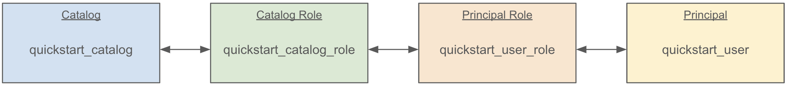

<!--
  Licensed to the Apache Software Foundation (ASF) under one
  or more contributor license agreements.  See the NOTICE file
  distributed with this work for additional information
  regarding copyright ownership.  The ASF licenses this file
  to you under the Apache License, Version 2.0 (the
  "License"); you may not use this file except in compliance
  with the License.  You may obtain a copy of the License at

   http://www.apache.org/licenses/LICENSE-2.0

  Unless required by applicable law or agreed to in writing,
  software distributed under the License is distributed on an
  "AS IS" BASIS, WITHOUT WARRANTIES OR CONDITIONS OF ANY
  KIND, either express or implied.  See the License for the
  specific language governing permissions and limitations
  under the License.
-->

# Quick Start

This guide serves as a introduction to several key entities that can be managed with Apache Polaris (Incubating), describes how to build and deploy Polaris locally, and finally includes examples of how to use Polaris with Apache Spark&trade;.

## Prerequisites

This guide covers building Polaris, deploying it locally or via [Docker](https://www.docker.com/), and interacting with it using the command-line interface and [Apache Spark](https://spark.apache.org/). Before proceeding with Polaris, be sure to satisfy the relevant prerequisites listed here.

### Building and Deploying Polaris

To get the latest Polaris code, you'll need to clone the repository using [git](https://git-scm.com/). You can install git using [homebrew](https://brew.sh/):

```shell
brew install git
```

Then, use git to clone the Polaris repo:

```shell
cd ~
git clone https://github.com/apache/polaris.git
```

#### With Docker

If you plan to deploy Polaris inside [Docker](https://www.docker.com/), you'll need to install docker itself. For example, this can be done using [homebrew](https://brew.sh/):

```shell
brew install --cask docker
```

Once installed, make sure Docker is running.

#### From Source

If you plan to build Polaris from source yourself, you will need to satisfy a few prerequisites first.

Polaris is built using [gradle](https://gradle.org/) and is compatible with Java 21. We recommend the use of [jenv](https://www.jenv.be/) to manage multiple Java versions. For example, to install Java 21 via [homebrew](https://brew.sh/) and configure it with jenv: 

```shell
cd ~/polaris
brew install openjdk@21 jenv
jenv add $(brew --prefix openjdk@21)
jenv local 21
```

### Connecting to Polaris

Polaris is compatible with any [Apache Iceberg](https://iceberg.apache.org/) client that supports the REST API. Depending on the client you plan to use, refer to the prerequisites below.

#### With Spark

If you want to connect to Polaris with [Apache Spark](https://spark.apache.org/), you'll need to start by cloning Spark. As [above](#building-and-deploying-polaris), make sure [git](https://git-scm.com/) is installed first. You can install it with [homebrew](https://brew.sh/):

```shell
brew install git
```

Then, clone Spark and check out a versioned branch. This guide uses [Spark 3.5](https://spark.apache.org/releases/spark-release-3-5-0.html).

```shell
cd ~
git clone https://github.com/apache/spark.git
cd ~/spark
git checkout branch-3.5
```

## Deploying Polaris

Polaris can be deployed via a lightweight docker image or as a standalone process. Before starting, be sure that you've satisfied the relevant [prerequisites](#building-and-deploying-polaris) detailed above.

### Docker Image

To start using Polaris in Docker, launch Polaris while Docker is running:

```shell
cd ~/polaris
docker compose -f docker-compose.yml up --build
```

Once the `polaris-polaris` container is up, you can continue to [Defining a Catalog](#defining-a-catalog).

### Building Polaris

Run Polaris locally with:

```shell
cd ~/polaris
./gradlew runApp
```

You should see output for some time as Polaris builds and starts up. Eventually, you won’t see any more logs and should see messages that resemble the following:

```
INFO  [...] [main] [] o.e.j.s.handler.ContextHandler: Started i.d.j.MutableServletContextHandler@...
INFO  [...] [main] [] o.e.j.server.AbstractConnector: Started application@...
INFO  [...] [main] [] o.e.j.server.AbstractConnector: Started admin@...
INFO  [...] [main] [] o.eclipse.jetty.server.Server: Started Server@...
```

At this point, Polaris is running.

## Bootstrapping Polaris

For this tutorial, we'll launch an instance of Polaris that stores entities only in-memory. This means that any entities that you define will be destroyed when Polaris is shut down. It also means that Polaris will automatically bootstrap itself with root credentials. For more information on how to configure Polaris for production usage, see the [docs](./configuring-polaris-for-production.md).

When Polaris is launched using in-memory mode the root principal credentials can be found in stdout on initial startup. For example:

```
realm: default-realm root principal credentials: <client-id>:<client-secret>
```

Be sure to note of these credentials as we'll be using them below. You can also set these credentials as environment variables for use with the Polaris CLI:

```shell
export CLIENT_ID=<client-id> 
export CLIENT_SECRET=<client-secret>
```

## Defining a Catalog

In Polaris, the [catalog](./entities.md#catalog) is the top-level entity that objects like [tables](./entities.md#table) and [views](./entities.md#view) are organized under. With a Polaris service running, you can create a catalog like so:

```shell
cd ~/polaris

./polaris \
  --client-id ${CLIENT_ID} \
  --client-secret ${CLIENT_SECRET} \
  catalogs \
  create \
  --storage-type s3 \
  --default-base-location ${DEFAULT_BASE_LOCATION} \
  --role-arn ${ROLE_ARN} \
  quickstart_catalog
```

This will create a new catalog called **quickstart_catalog**.

The `DEFAULT_BASE_LOCATION` you provide will be the default location that objects in this catalog should be stored in, and the `ROLE_ARN` you provide should be a [Role ARN](https://docs.aws.amazon.com/IAM/latest/UserGuide/reference-arns.html) with access to read and write data in that location. These credentials will be provided to engines reading data from the catalog once they have authenticated with Polaris using credentials that have access to those resources.

If you’re using a storage type other than S3, such as Azure, you’ll provide a different type of credential than a Role ARN. For more details on supported storage types, see the [docs](./entities.md#storage-type).

Additionally, if Polaris is running somewhere other than `localhost:8181`, you can specify the correct hostname and port by providing `--host` and `--port` flags. For the full set of options supported by the CLI, please refer to the [docs](./command-line-interface.md).


### Creating a Principal and Assigning it Privileges

With a catalog created, we can create a [principal](./entities.md#principal) that has access to manage that catalog. For details on how to configure the Polaris CLI, see [the section above](#defining-a-catalog) or refer to the [docs](./command-line-interface.md).

```shell
./polaris \
  --client-id ${CLIENT_ID} \
  --client-secret ${CLIENT_SECRET} \
  principals \
  create \
  quickstart_user

./polaris \
  --client-id ${CLIENT_ID} \
  --client-secret ${CLIENT_SECRET} \
  principal-roles \
  create \
  quickstart_user_role

./polaris \
  --client-id ${CLIENT_ID} \
  --client-secret ${CLIENT_SECRET} \
  catalog-roles \
  create \
  --catalog quickstart_catalog \
  quickstart_catalog_role
```

Be sure to provide the necessary credentials, hostname, and port as before.

When the `principals create` command completes successfully, it will return the credentials for this new principal. Be sure to note these down for later. For example:

```
./polaris ... principals create example
{"clientId": "XXXX", "clientSecret": "YYYY"}
```

Now, we grant the principal the [principal role](./entities.md#principal-role) we created, and grant the [catalog role](./entities.md#catalog-role) the principal role we created. For more information on these entities, please refer to the linked documentation.

```shell
./polaris \
  --client-id ${CLIENT_ID} \
  --client-secret ${CLIENT_SECRET} \
  principal-roles \
  grant \
  --principal quickstart_user \
  quickstart_user_role

./polaris \
  --client-id ${CLIENT_ID} \
  --client-secret ${CLIENT_SECRET} \
  catalog-roles \
  grant \
  --catalog quickstart_catalog \
  --principal-role quickstart_user_role \
  quickstart_catalog_role
```

Now, we’ve linked our principal to the catalog via roles like so:



In order to give this principal the ability to interact with the catalog, we must assign some [privileges](./entities.md#privilege). For the time being, we will give this principal the ability to fully manage content in our new catalog. We can do this with the CLI like so:

```shell
./polaris \
  --client-id ${CLIENT_ID} \
  --client-secret ${CLIENT_SECRET} \
  privileges \
  catalog \
  grant \
  --catalog quickstart_catalog \
  --catalog-role quickstart_catalog_role \
  CATALOG_MANAGE_CONTENT
```

This grants the [catalog privileges](./entities.md#privilege) `CATALOG_MANAGE_CONTENT` to our catalog role, linking everything together like so:


`CATALOG_MANAGE_CONTENT` has create/list/read/write privileges on all entities within the catalog. The same privilege could be granted to a namespace, in which case the principal could create/list/read/write any entity under that namespace.

## Using Iceberg & Polaris

At this point, we’ve created a principal and granted it the ability to manage a catalog. We can now use an external engine to assume that principal, access our catalog, and store data in that catalog using [Apache Iceberg](https://iceberg.apache.org/).

### Connecting with Spark

To use a Polaris-managed catalog in [Apache Spark](https://spark.apache.org/), we can configure Spark to use the Iceberg catalog REST API.

This guide uses [Apache Spark 3.5](https://spark.apache.org/releases/spark-release-3-5-0.html), but be sure to find [the appropriate iceberg-spark package for your Spark version](https://mvnrepository.com/artifact/org.apache.iceberg/iceberg-spark). From a local Spark clone on the `branch-3.5` branch we can run the following:

_Note: the credentials provided here are those for our principal, not the root credentials._

```shell
bin/spark-shell \
--packages org.apache.iceberg:iceberg-spark-runtime-3.5_2.12:1.5.2,org.apache.hadoop:hadoop-aws:3.4.0 \
--conf spark.sql.extensions=org.apache.iceberg.spark.extensions.IcebergSparkSessionExtensions \
--conf spark.sql.catalog.quickstart_catalog.warehouse=quickstart_catalog \
--conf spark.sql.catalog.quickstart_catalog.header.X-Iceberg-Access-Delegation=vended-credentials \
--conf spark.sql.catalog.quickstart_catalog=org.apache.iceberg.spark.SparkCatalog \
--conf spark.sql.catalog.quickstart_catalog.catalog-impl=org.apache.iceberg.rest.RESTCatalog \
--conf spark.sql.catalog.quickstart_catalog.uri=http://localhost:8181/api/catalog \
--conf spark.sql.catalog.quickstart_catalog.credential='XXXX:YYYY' \
--conf spark.sql.catalog.quickstart_catalog.scope='PRINCIPAL_ROLE:ALL' \
--conf spark.sql.catalog.quickstart_catalog.token-refresh-enabled=true
```


Replace `XXXX` and `YYYY` with the client ID and client secret generated when you created the `quickstart_user` principal.

Similar to the CLI commands above, this configures Spark to use the Polaris running at `localhost:8181`. If your Polaris server is running elsewhere, but sure to update the configuration appropriately.

Finally, note that we include the `hadoop-aws` package here. If your table is using a different filesystem, be sure to include the appropriate dependency.

Once the Spark session starts, we can create a namespace and table within the catalog:

```
spark.sql("USE quickstart_catalog")
spark.sql("CREATE NAMESPACE IF NOT EXISTS quickstart_namespace")
spark.sql("CREATE NAMESPACE IF NOT EXISTS quickstart_namespace.schema")
spark.sql("USE NAMESPACE quickstart_namespace.schema")
spark.sql("""
	CREATE TABLE IF NOT EXISTS quickstart_table (
		id BIGINT, data STRING
	) 
USING ICEBERG
""")
```

We can now use this table like any other:

```
spark.sql("INSERT INTO quickstart_table VALUES (1, 'some data')")
spark.sql("SELECT * FROM quickstart_table").show(false)
. . .
+---+---------+
|id |data     |
+---+---------+
|1  |some data|
+---+---------+
```

If at any time access is revoked...

```shell
./polaris \
  --client-id ${CLIENT_ID} \
  --client-secret ${CLIENT_SECRET} \
  privileges \
  catalog \
  revoke \
  --catalog quickstart_catalog \
  --catalog-role quickstart_catalog_role \
  CATALOG_MANAGE_CONTENT
```

Spark will lose access to the table:

```
spark.sql("SELECT * FROM quickstart_table").show(false)

org.apache.iceberg.exceptions.ForbiddenException: Forbidden: Principal 'quickstart_user' with activated PrincipalRoles '[]' and activated ids '[6, 7]' is not authorized for op LOAD_TABLE_WITH_READ_DELEGATION
```
