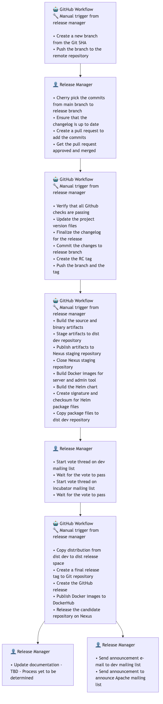

<!--
Licensed to the Apache Software Foundation (ASF) under one
or more contributor license agreements.  See the NOTICE file
distributed with this work for additional information
regarding copyright ownership.  The ASF licenses this file
to you under the Apache License, Version 2.0 (the
"License"); you may not use this file except in compliance
with the License.  You may obtain a copy of the License at

  http://www.apache.org/licenses/LICENSE-2.0

Unless required by applicable law or agreed to in writing,
software distributed under the License is distributed on an
"AS IS" BASIS, WITHOUT WARRANTIES OR CONDITIONS OF ANY
KIND, either express or implied.  See the License for the
specific language governing permissions and limitations
under the License.
-->

# Releasey Scripts

## Important Notice

⚠️ **These scripts are designed for automation and should only be used by GitHub workflows.**

The scripts in this directory are:
- Optimized for the GitHub Actions environment
- Designed to work with specific workflow contexts and environment variables
- Not intended for manual execution by release managers

## Release Process Overview

The Polaris release automation follows a structured workflow as illustrated in the flowchart below. The process involves both automated GitHub workflows and manual steps performed by release managers.

## GitHub Workflows

The release automation is implemented through the following GitHub workflows:

1. **[Create Release Branch](../.github/workflows/release-1-create-release-branch.yml)** - Creates a new release branch from a specified Git SHA
2. **[Update Release Candidate](../.github/workflows/release-2-update-release-candidate.yml)** - Updates version files, finalizes changelog, and creates RC tags
3. **[Build and Publish Artifacts](../.github/workflows/release-3-build-and-publish-artifacts.yml)** - Consolidated workflow that:
   - Performs prerequisite checks (tag validation, version extraction)
   - Builds source/binary artifacts and publishes to Nexus staging
   - Builds Docker images for server and admin tool
   - Builds Helm charts and stages them to dist dev repository
4. **[Publish Release](../.github/workflows/release-4-publish-release.yml)** - Finalizes the release:
   - Copies distribution from dist dev to dist release space
   - Creates a final release tag and GitHub release
   - Publishes Docker images to Docker Hub
   - Releases the candidate repository on Nexus

## Directory Structure

- `libs/` - Shared library functions used across release scripts
  - `_constants.sh` - Common constants and configuration
  - `_exec.sh` - Command execution utilities
  - `_github.sh` - GitHub API interaction functions
  - `_log.sh` - Logging utilities
  - `_version.sh` - Version handling functions