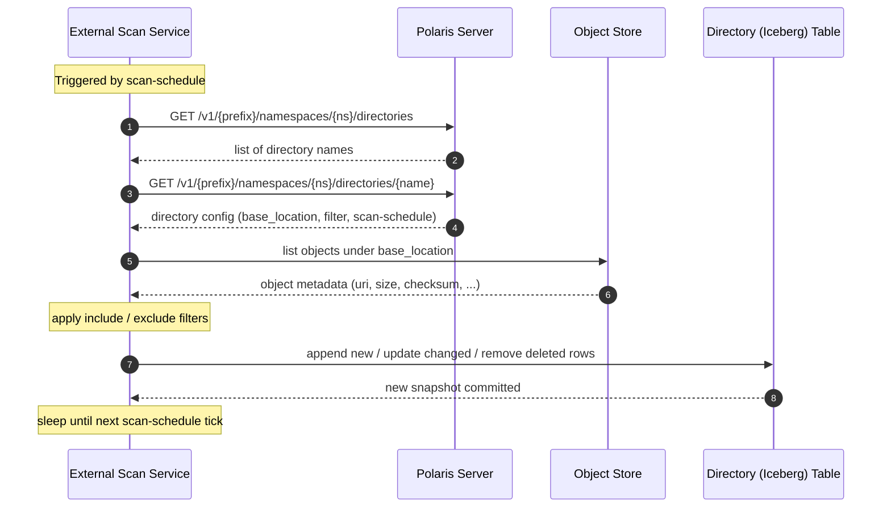

---
#
# Licensed to the Apache Software Foundation (ASF) under one
# or more contributor license agreements.  See the NOTICE file
# distributed with this work for additional information
# regarding copyright ownership.  The ASF licenses this file
# to you under the Apache License, Version 2.0 (the
# "License"); you may not use this file except in compliance
# with the License.  You may obtain a copy of the License at
#
#   http://www.apache.org/licenses/LICENSE-2.0
#
# Unless required by applicable law or agreed to in writing,
# software distributed under the License is distributed on an
# "AS IS" BASIS, WITHOUT WARRANTIES OR CONDITIONS OF ANY
# KIND, either express or implied.  See the License for the
# specific language governing permissions and limitations
# under the License.
#
title: Directories
type: docs
weight: 450
---

## Overview

Directories make objects (including unstructured data like images, videos, documents, and other objects) discoverable alongside
structured Iceberg tables within a Polaris catalog. 
A directory points to a base location/prefix on an object store and automatically tracks the objects it contains by maintaining 
an Iceberg table with object-level metadata such as URI, size, content type, checksum, ...

This means query engines and tools that already know how to read Iceberg tables can discover and
access unstructured data with little or no extra work (accessing the object itself).

## Concepts

A directory has two main parts:

1. **Directory configuration** — stored by the Polaris server. It describes _where_ the data lives,
   how to authenticate, which objects to include, and how often to re-scan. The configuration "lives" in a namespace.
2. **Directory table** — an Iceberg table serving as the inventory of all objects contained in the directory, one row per object discovered during a scan.
   The directory table uses the configuration name.

The Polaris server itself does not perform scans. Instead, external services (e.g. directory table scanning service) read the directory configuration through the REST API,
walk the object store, and write the results into the directory table.

## Configuration

A directory is described by the following fields:

| Field | Type | Required | Description |
|-------|------|----------|-------------|
| `name` | `string` | Yes | The name of the directory. It is used in REST endpoint paths and becomes the name of the corresponding Iceberg table. |
| `base_location` | `string` | Yes | The base location to use as a root for scanning objects in the object store (for example `s3://my-bucket/images/`, `gs://my-bucket/docs/`, or `file:///data/local/`). |
| `filter` | `object` | No | Include and exclude patterns that control which objects are added to the directory table during a scan. See [Filter](#filter). |
| `scan-schedule` | `object` | No | Object representing a scan schedule (trigger, cron, ...). |

### Storage access

Directories use Polaris `StorageAccessConfig` to access the object store.

### Filter

The `filter` object controls which objects are included in the directory table during a scan.

If no filter is set, all objects found under the directory `base_location` are included.

`include` and `exclude` are lists of regular expressions matched against the object's full URI. An
object is included if it matches at least one `include` pattern (or `include` is omitted) and does
not match any `exclude` pattern.

**Example** — include only JPEG and PNG images, but exclude thumbnails:

```json
{
  "filter": {
    "include": [".*\\.jpg$", ".*\\.png$"],
    "exclude": [".*thumbs/.*"]
  }
}
```

### Example: creating a directory

```json
POST /v1/{prefix}/namespaces/{namespace}/directories

{
  "name": "product-images",
  "base_location": "s3://warehouse/product-images/",
  "filter": {
    "include": [".*\\.jpg$", ".*\\.png$"]
  },
  "scan-schedule": {
    "cron": "0 * * * *"
  }
}
```

## REST endpoints

Directories are managed through the following REST endpoints. All paths are relative to the catalog
base URL.

### List directories

**GET** `/v1/{prefix}/namespaces/{namespace}/directories`

Returns the list of directory identifiers in the given namespace.

### Create a directory

**POST** `/v1/{prefix}/namespaces/{namespace}/directories`

Creates a new directory and its corresponding Iceberg table. The request body must contain the
directory configuration (see [Configuration](#configuration)).

### Get directory details

**GET** `/v1/{prefix}/namespaces/{namespace}/directories/{directory}`

Returns the full configuration of the specified directory, including filter and scan schedule.

### Drop a directory

**DELETE** `/v1/{prefix}/namespaces/{namespace}/directories/{directory}`

Removes the directory and its associated Iceberg table from the namespace.

## Directory table

When a directory is created, Polaris creates an Iceberg table in the same namespace using the directory
`name` as the table name. The table uses the following schema:

| Field Id | Field Name | Type | Required | Description |
|----------|------------|------|----------|-------------|
| 1 | `file_uri` | `string` | Yes | The fully qualified URI of the object (for example `s3://my-bucket/images/photo.jpg`). |
| 2 | `content_type` | `string` | No | The MIME content type (RFC 2045) of the object (for example `image/jpeg`, `application/pdf`). |
| 3 | `size` | `long` | No | The size of the object in bytes. |
| 4 | `checksum_algorithm` | `string` | No | The name of the checksum algorithm (for example `MD5`, `SHA-256`, `CRC32`). |
| 5 | `checksum` | `string` | No | The object checksum value computed with the algorithm specified in `checksum_algorithm`. |
| 6 | `last_modified` | `timestamptz` | No | The last modification timestamp of the object as reported by the object store. |
| 7 | `metadata` | `map<string, string>` | No | Additional labels and tags from the object store (for example S3 user-defined metadata, storage class, or content encoding). |

Clients (query engines, analytics tools, etc.) interact with the directory table as a regular Iceberg
table. For instance, you can query it with Spark SQL:

```sql
SELECT file_uri, size, last_modified
FROM my_catalog.my_namespace.product_images
WHERE content_type = 'image/jpeg'
  AND size > 1048576
ORDER BY last_modified DESC;
```

### Credential vending

The directory table might contain additional fields for credential vending.
For instance, a token might be present (provided by a Polaris service/API) stored in the directory table (for each object)
along with additional fields to verify the token.

## External services (scanning services)

The Polaris server stores directory configurations and exposes the REST endpoints described above, but
it does **not** perform object scanning or table updates by itself. These operations are handled by
external services.

### How external services could work

The diagram below shows one scan cycle of an external scanning service:



1. **Discovery** — A service calls the
   [List directories](#list-directories) endpoint to discover which directories exist and then calls
   [Get directory details](#get-directory-details) to retrieve each directory's configuration.

2. **Scan** — The service walks the object store location specified by the directory `base_location`,
   applying the configured [filter](#filter) rules. It collects metadata for each matching object
   (size, content type, checksum, last modified timestamp, and any object-store-specific metadata).

3. **Table update** — The service writes the scan results into the directory's Iceberg
   table, appending new objects, updating changed objects, and removing objects that no longer exist on
   the object store. This produces a new Iceberg table snapshot.

4. **Scheduling** — The service respects the directory's `scan-schedule` to determine how
   frequently to repeat the scan. For example, a `scan-schedule` with `cron` set to `0 * * * *`
   means the service should re-scan at the top of every hour.

### Deployment model

External services run as separate processes from the Polaris server. They can be deployed as:

- A standalone service alongside the Polaris server
- A scheduled job (for example a Kubernetes CronJob)
- A serverless function triggered on a schedule

A single service instance can manage multiple directories. Multiple instances can also
operate on different directories for horizontal scalability.

### Failure handling

If a scan fails (for example due to a transient network error or permission issue), the directory 
table remains unchanged. 
The service should retry on the next scan cycle according to the configured `scan-schedule`.
